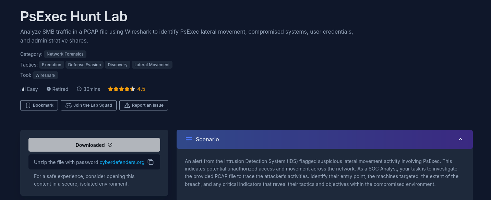
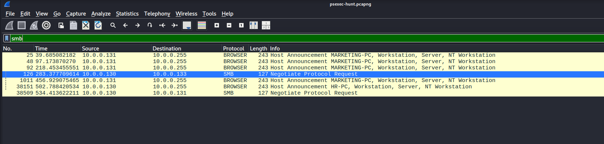
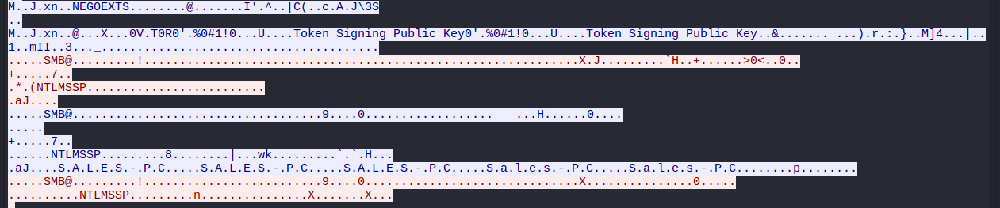
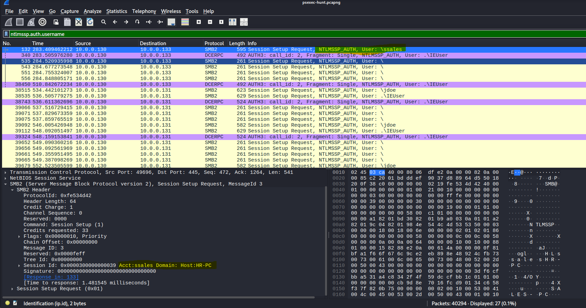
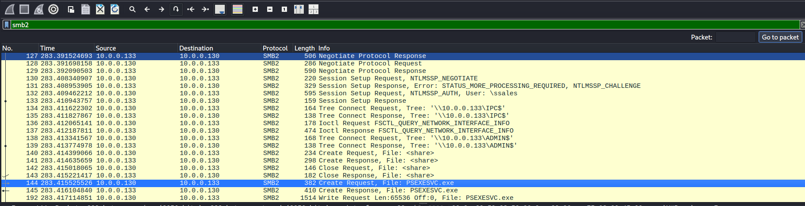
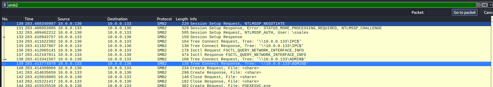
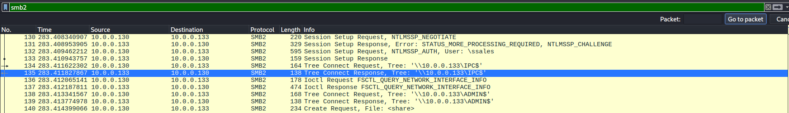
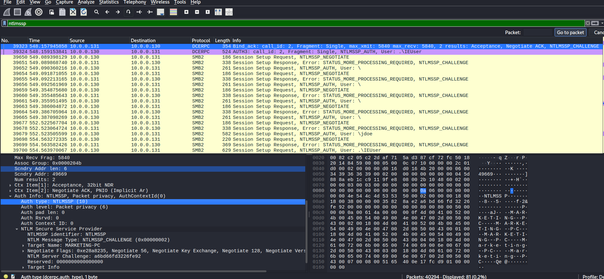
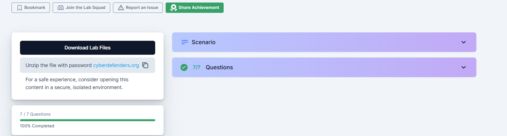

# Wireshark-Traffic-CTF
This Capture the Flag exercise is about an SMB traffic in a PCAP file. I have to use Wireshark to analyze the lateral movement, compromised systems, user credentials, and administrative shares that took place.

 

There is a file to download. For security reasons, I used my Kali Linux VM to open and run the mail attached to this lab

### Question 1
To effectively trace the attacker's activities within our network, can you identify the IP address of the machine from which the attacker initially gained access?

**Answer:**
The question already hints at an SMB traffic, and that will be the beginning of my research. I noticed there is a negotiation underway. I investigate, and there, I have my source and destination IP. Answer: 10.0.0.130  

 

### Question 2
To fully understand the extent of the breach, can you determine the machine's hostname to which the attacker first pivoted?

**Answer:**
I already have a source and destination IP. With a right click, I follow the TCP stream. There is the client in red and the server in blue. The stream indicated that it involves the Sales PC

 

### Question 3
Knowing the username of the account the attacker used for authentication will give us insights into the extent of the breach. What is the username utilized by the attacker for authentication?

**Answer:**
I will apply an authentication protocol commonly used for network security. the ntlmssp.auth.username. The first line already gives me the answer, but for more details, I check the final layer of the OSI model

 

### Question 4
After figuring out how the attacker moved within our network, we need to know what they did on the target machine. What's the name of the service executable the attacker set up on the target?

**Answer:**
The answer was easy to find. I scrolled around the packets

 

### Question 5
We need to know how the attacker installed the service on the compromised machine to understand the attacker's lateral movement tactics. This can help identify other affected systems. Which network share was used by PsExec to install the service on the target machine?

**Answer:**
I investigated the same search history and found my answer: ADMIN$

 

### Question 6
We must identify the network share used to communicate between the two machines. Which network share did PsExec use for communication?

**Answer:**

 

### Question 7
Now that we have a clearer picture of the attacker's activities on the compromised machine, it's important to identify any further lateral movement. What is the hostname of the second machine the attacker targeted to pivot within our network?

**Answer:**
Here, I had to return to the ntlmssp. I notice the DECEP tried another negotiation on another machine. When investigating the 5th layer, I found my answer: Marketing department.

 

And Voila! 

